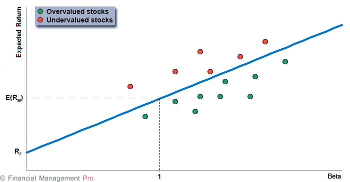
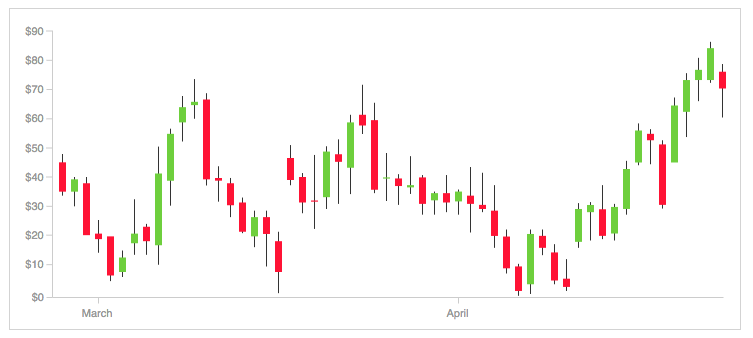
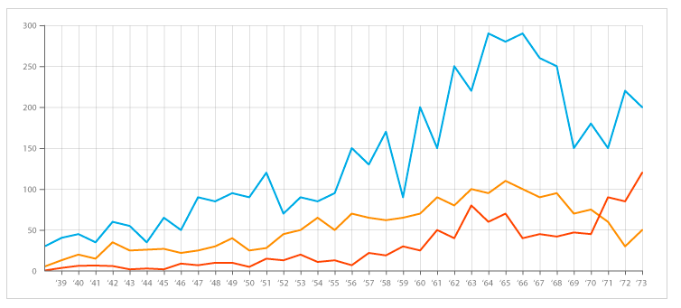

# Stock Checker 5000
#### Data Sources
- https://iextrading.com/developer/docs/#getting-started
Via deze website wordt de data verkregen. Je kan een request doen via deze API.

Voor de eerste visualisatie is er data nodig van de beta van elk bedrijf op de markt (S&P500) en de bijbehorende stock return. Er moet een gemiddelde worden genomen van de returns over een bepaalde periode. Via de API kunnen de returns en de beta opgevraagd worden.

Voor de tweede visualisatie heb ik een dataset nodig met alle bedrijven op de markt (S&P500) en de bijbehorende stock prices voor de meest recente 30/31 dagen. Als er in de scatterplot op een bedrijf wordt geklikt, worden gegevens opgevraagd via de API. Via de API kan de high, low, end en close price van een bepaald aandeel worden opgevraagd. Deze worden dan gerepresenteerd in de candlestick chart.

Voor de derde visualisatie heb ik een data nodig waarbij ik óf per dag het verloop van de stock price laat zien via een line graph, óf het verloop van de dividenduitkering laat zien via een line graph of bar chart. Deze informatie kan wederom opgevraagd worden vai de API. Ik ben er nog niet over uit of het mogelijk is om 'per uur data' op te vragen. Als dit wel mogelijk is, zal ik een line graph maken van het verloop van de stock price. Als dit niet mogelijk is, ga ik een andere variabele visualiseren als dividend of debt/equity variabelen.

#### Technical Components
Het dropdown menu en de search engine worden gemaakt via Bootstrap. Meerdere jaren kunnen geselecteerd worden en er kan gezocht worden op symbool. Benodigdheden: Bootstrap 4.1.1

Er kan geklikt worden op alle 'dots' in de scatterplot. Daarnaast kan er gehoverd worden over de 'dots' waarna de bedrijfsnaam, de return en de bèta verschijnen. Hiervoor is D3-tip nodig. Op het moment van klikken, zal er via een candlestick chart per bedrijf worden weergegeven wat de hoogste, laagste, open en close stock price is per meest recente 30/31 dagen.  Als er wordt gehoverd over de candles, worden de stock prices (high, low, open, end) op dat moment weergegeven. Hiervoor is D3-tip nodig.

Uiteindelijk kan je op een candle klikken en op dat moment verschijnt er een dagelijks verloop van de stock price. Als er wordt gehoverd over de lijn, worden de waarden weergegeven. Hiervoor is wederom D3-tip nodig.

Als het niet mogelijk is om de 'per uur data' te verkrijgen via de API, dan zal ik via een barchart of line graph andere financiële variabelen weergeven. Deze barchart of deze line graph zijn wederom hoverable middels d3-tip.

#### Plugins
- https://iextrading.com/developer/docs/#getting-started
- D3 V4
- D3-tip
- Bootstrap 4.1.1
