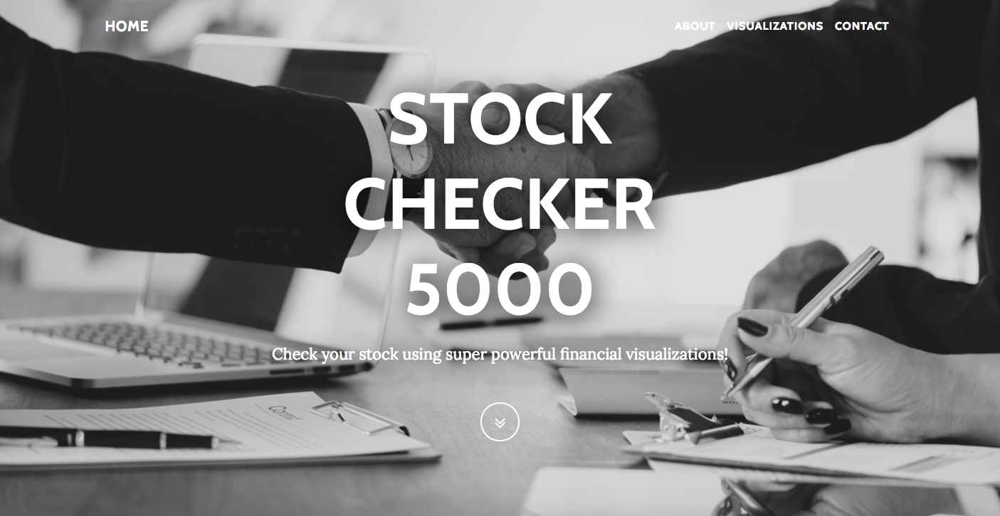
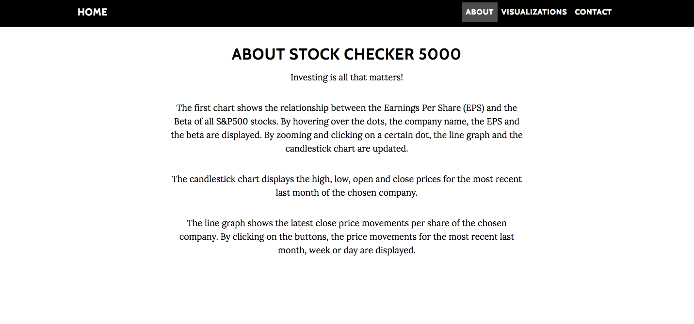
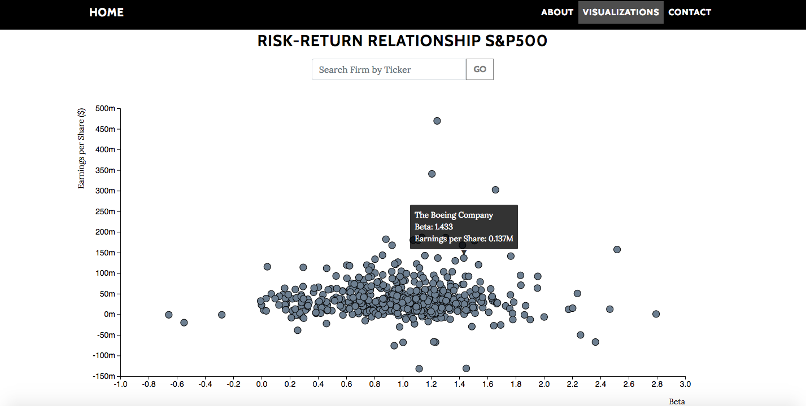
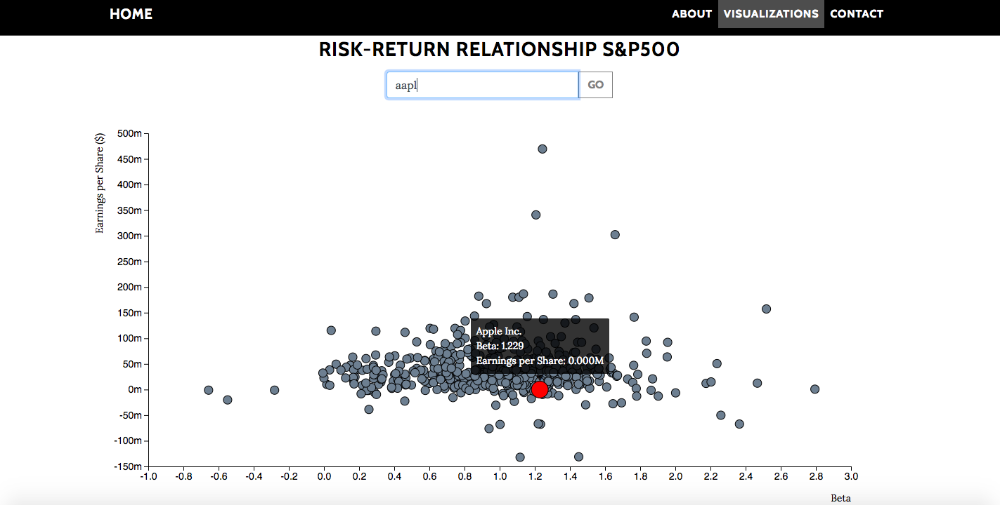
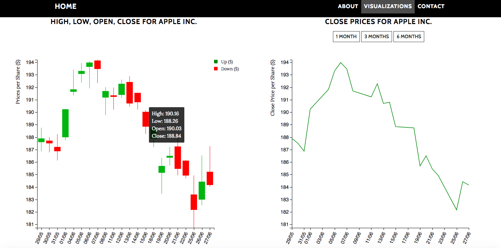
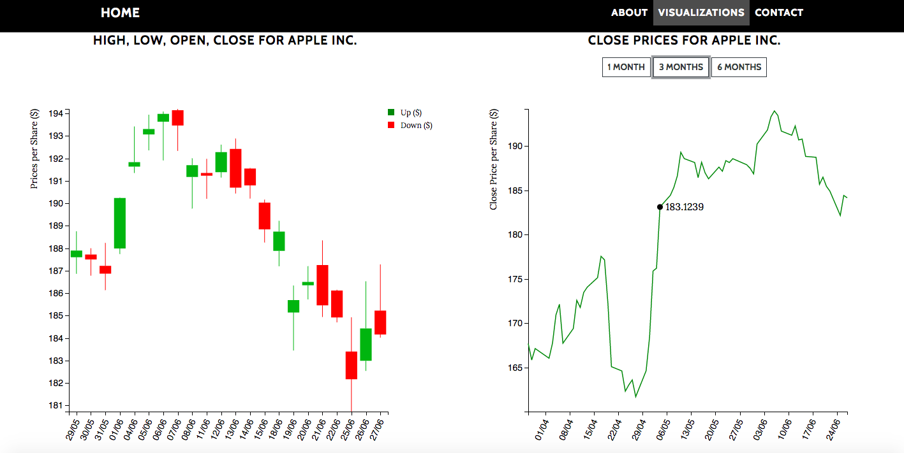

# Stock Checker 5000
Naam: Amy van der Gun \
Studentnummer: 10791760

[Stock Checker 5000](https://amyvdgun.github.io/DataProject/)

In dit project visualiseer ik financiële data van de S&P500.

## Het Doel
Voor investeerders is het lastig om de juiste afweging te maken tussen het nemen risico's en het verkrijgen van rendementen. Het is een uitdaging om het rendement ten opzichte van het risico te maximaliseren. Daarbij, aandelenkoersen kunnen erg fluctueren. Het is daarom van **groot belang** om de Stock Checker 5000 te raadplegen voor:
- Een overzicht van de relatie tussen Beta en de Earnings per Share (EPS) van alle S&P500 aandelen
- Een maandoverzicht van de high, low, open en close prijzen per S&P500 aandeel
- Een maand/kwartaal/halfjaar overzicht van de close prijzen per S&P500 aandeel

Op deze manier kan een investeerder gemakkelijk inzicht krijgen in de relatie tussen risico en rendement én in de volatiliteit en de meest recente prijsontwikkelingen van een bepaald aandeel.

In de **Stock Checker 5000** wordt "realtime" data gebruikt.

## De Werking

Druk op de knop of scroll naar beneden voor de volgende sectie. Daar is te lezen hoe de grafieken werken en wat de gebruiker ermee kan.

Scroll naar beneden voor de visualisaties. Allereerst is de scatter plot te zien. De plot weergeeft het verband tussen de beta en de EPS van alle S&P500 aandelen. Omdat de puntenwolk groot is, kan er worden ingezoomd op elk punt in de grafiek. Verder kan er gehoverd worden over alle punten; de bedrijfsnaam, de beta en de EPS worden dan weergegeven.

De gebruiker kan zoeken op een ticker symbool. Op het moment dat het ticker symbool geldig is, wordt de desbetreffende dot rood en groter gemaakt. Dit maakt het voor de gebruiker makkelijk om een bedrijf te selecteren voor de line en candlestick chart.

Op het moment dat de gebruiker klikt op een bepaalde dot, wordt er automatisch doorgescrolld naar de line en candlestick chart. Als de gebruiker hovert over de candles, wordt er weergegeven wat op dat punt de high, low, open en close prijzen zijn van de gekozen stock. Ook kan er over de line chart gehoverd worden en zal de close prijs op dat moment worden weergegeven.

Verder kan de gebruiker boven de line chart op 3 buttons klikken. De eerste button (default button) zorgt ervoor dat de close prijzen van de meest recente maand worden weergegeven. De tweede button zorgt ervoor dat de close prijzen van het meest recente kwartaal worden weergegeven. De derde button zorgt ervoor dat de close prijzen van het meest recente halfjaar worden weergegeven.

## Externe Bronnen
- Bootstrap grayscale > in 'bootstrap' folder (MIT License)
- Techan.js > in 'code/js' folder (MIT License)
- D3 V4 (BSD 3-Clause "New" or "Revised" License)
- d3-tip 0.7.1 (Apache License 2.0)
- Photo by rawpixel on [Unsplash](https://unsplash.com/photos/XkKhkijcgTo)

## Inspiratie
- http://bl.ocks.org/andredumas/27c4a333b0e0813e093d
- https://bl.ocks.org/d3noob/402dd382a51a4f6eea487f9a35566de0
- https://bl.ocks.org/aleereza/d2be3d62a09360a770b79f4e5527eea8
- https://bl.ocks.org/EfratVil/d956f19f2e56a05c31fb6583beccfda7

## Copyright
- Bootstrap grayscale

The MIT License (MIT)

Copyright (c) 2013-2018 Blackrock Digital LLC

Permission is hereby granted, free of charge, to any person obtaining a copy of this software and associated documentation files (the "Software"), to deal in the Software without restriction, including without limitation the rights to use, copy, modify, merge, publish, distribute, sublicense, and/or sell copies of the Software, and to permit persons to whom the Software is furnished to do so, subject to the following conditions:

The above copyright notice and this permission notice shall be included in all copies or substantial portions of the Software.

THE SOFTWARE IS PROVIDED "AS IS", WITHOUT WARRANTY OF ANY KIND, EXPRESS OR IMPLIED, INCLUDING BUT NOT LIMITED TO THE WARRANTIES OF MERCHANTABILITY, FITNESS FOR A PARTICULAR PURPOSE AND NONINFRINGEMENT. IN NO EVENT SHALL THE AUTHORS OR COPYRIGHT HOLDERS BE LIABLE FOR ANY CLAIM, DAMAGES OR OTHER LIABILITY, WHETHER IN AN ACTION OF CONTRACT, TORT OR OTHERWISE, ARISING FROM, OUT OF OR IN CONNECTION WITH THE SOFTWARE OR THE USE OR OTHER DEALINGS IN THE SOFTWARE.

- Techan.js

The MIT License

Copyright (c) 2014 André Dumas https://github.com/andredumas/techan.js

Permission is hereby granted, free of charge, to any person obtaining a copy
of this software and associated documentation files (the "Software"), to deal
in the Software without restriction, including without limitation the rights
to use, copy, modify, merge, publish, distribute, sublicense, and/or sell
copies of the Software, and to permit persons to whom the Software is
furnished to do so, subject to the following conditions:

The above copyright notice and this permission notice shall be included in
all copies or substantial portions of the Software.

THE SOFTWARE IS PROVIDED "AS IS", WITHOUT WARRANTY OF ANY KIND, EXPRESS OR
IMPLIED, INCLUDING BUT NOT LIMITED TO THE WARRANTIES OF MERCHANTABILITY,
FITNESS FOR A PARTICULAR PURPOSE AND NONINFRINGEMENT. IN NO EVENT SHALL THE
AUTHORS OR COPYRIGHT HOLDERS BE LIABLE FOR ANY CLAIM, DAMAGES OR OTHER
LIABILITY, WHETHER IN AN ACTION OF CONTRACT, TORT OR OTHERWISE, ARISING FROM,
OUT OF OR IN CONNECTION WITH THE SOFTWARE OR THE USE OR OTHER DEALINGS IN
THE SOFTWARE.

- D3 V4

Copyright 2010-2017 Mike Bostock All rights reserved.

- D3 tip 0.7.1.

Copyright (c) 2013 Justin Palmer
