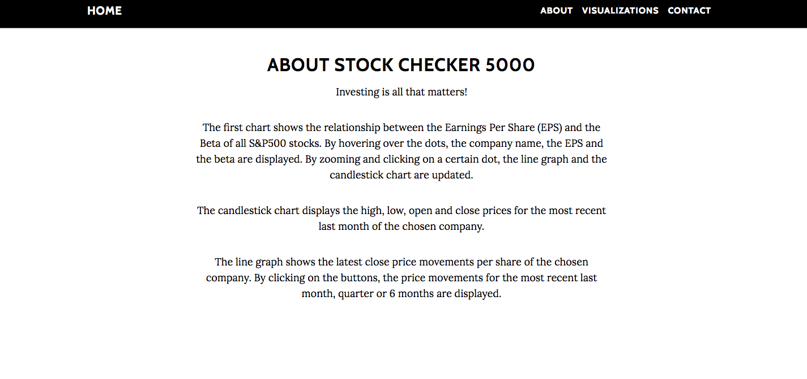

# Stock Checker 5000
Naam: Amy van der Gun \
Studentnummer: 10791760

[Stock Checker 5000](https://amyvdgun.github.io/DataProject/)

In dit project visualiseer ik financiële data van de S&P500.

## Het Doel
Voor investeerders is het lastig om de juiste afweging te maken tussen het nemen risico's en het verkrijgen van rendementen. Het is een uitdaging om het rendement ten opzichte van het risico te maximaliseren. Daarbij, aandelenkoersen kunnen erg fluctueren. Het is daarom van **groot belang** om de Stock Checker 5000 te raadplegen voor:
- Een overzicht van de relatie tussen Beta en de Earnings per Share (EPS) van alle S&P500 aandelen
- Een maandoverzicht van de high, low, open en close prijzen per S&P500 aandeel
- Een maand/kwartaal/halfjaar overzicht van de close prijzen per S&P500 aandeel

Op deze manier kan een investeerder gemakkelijk inzicht krijgen in de relatie tussen risico en rendement én in de volatiliteit en de meest recente prijsontwikkelingen van een bepaald aandeel.

In de **Stock Checker 5000** wordt "realtime" data gebruikt.

## De Werking

Druk op de knop of scroll naar beneden voor de volgende sectie. Daar is te lezen hoe de grafieken werken en wat de gebruiker ermee kan.

Scroll naar beneden voor de visualisaties. Allereerst is de scatter plot te zien. De plot weergeeft het verband tussen de beta en de EPS van alle S&P500 aandelen. Omdat de puntenwolk groot is, kan er worden ingezoomd op elk punt in de grafiek. Verder kan er gehoverd worden over alle punten; de bedrijfsnaam, de beta en de EPS worden dan weergegeven. De gebruiker kan zoeken op een ticker symbool. Op het moment dat het ticker symbool geldig is, wordt de desbetreffende dot rood en groter gemaakt. Dit maak het voor de gebruiker makkelijk om een bedrijf te selecteren voor de line en candlestick chart. 

## Inspiratie
