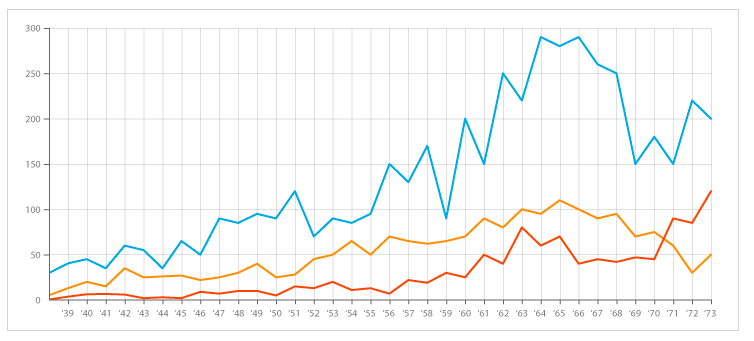

# DataProject
#### Introductie
Ik, Amy van der Gun, visualiseer meerdere datasets in dit project.

#### Problem Statement
Het is voor veel investeerders onduidelijk hoe risico verband houdt met rendement. Het idee van investeren is dat je het rendement ten opzichte van het risico maximaliseert. Het is daarom van belang dat er overzicht gecreëerd wordt met betrekking tot dit probleem.

#### Solution
Deze visualisaties zullen het verband laten zien tussen het risico en rendement van aandelen op de AEX index.

#### Prerequisites
