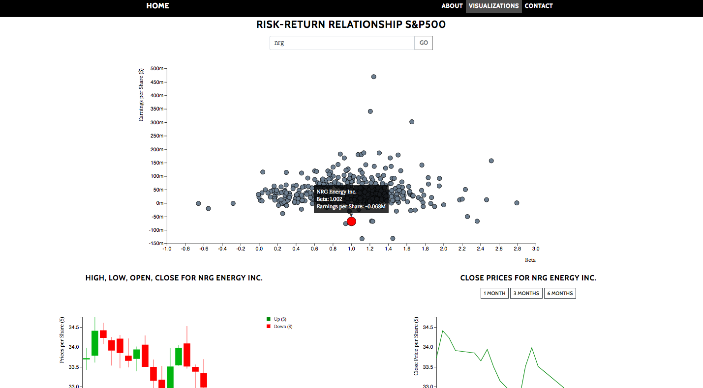

# Stock Checker 5000 - REPORT
[Stock Checker 5000](https://amyvdgun.github.io/DataProject/)
## Introductie
De Stock Checker 5000 biedt inzichten voor investeerders voor wie het vaak lastig is om een afweging te maken tussen risico en rendement. Alle S&P500 aandelen kunnen worden geanalyseerd. Elke afzonderlijke stock kan worden geanalyseerd door de candlestick en line chart te bekijken. Door gebruik te maken van alle interactieve elementen, kan het raadplegen van de Stock Checker als erg nuttig ervaren worden.

Start with a short description of your application (like in the README.md, but very short, including a single screen shot).

Clearly describe the technical design: how is the functionality implemented in your code? This should be like your DESIGN.md but updated to reflect the final application. First, give a high level overview, which helps us navigate and understand the total of your code (which components are there?). Second, go into detail, and describe the modules/classes (apps) files/functions (data) and how they relate.

Clearly describe challenges that your have met during development. Document all important changes that your have made with regard to your design document (from the PROCESS.md). Here, we can see how much you have learned in the past month.

Defend your decisions by writing an argument of a most a single paragraph. Why was it good to do it different than you thought before? Are there trade-offs for your current solution? In an ideal world, given much more time, would you choose another solution?

Make sure the document is complete and reflects the final state of the application. The document will be an important part of your grade.
